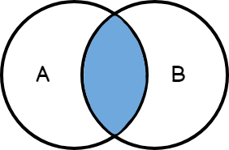

# Joins

Joins are operations that allow combining data from two or more tables based on a specific condition. This condition usually involves a relationship between columns of the tables being joined. Joins are essential for performing complex queries involving multiple tables.

  

## Inner Join

- This type of Join returns only the rows that have at least one match in both tables.
- When an Inner Join is performed, the specified condition is applied to both tables, and only the rows that meet that condition are included in the result.
- For example, if you are joining an employees table with a departments table using the department ID as a key, an Inner Join will only return the rows where employees are assigned to an existing department.

  

## Left Join (Left Outer Join)

- A Left Join returns all the rows from the left table, along with the corresponding rows from the right table that meet the join condition, if any.
- If there are no matches in the right table for a row in the left table, NULL will be included in the columns from the right table in the result.
- This type of Join is useful when you want to include all the rows from the left table, regardless of whether they have matches in the right table.

  

## Right Join (Right Outer Join)

- The Right Join is essentially the opposite of the Left Join.
- It returns all the rows from the right table and the corresponding rows from the left table that meet the join condition.
- If there are no matches in the left table for a row in the right table, NULL will be included in the columns from the left table in the result.
- Although less common than the Left Join, the Right Join can be useful when you want to include all the rows from the right table, regardless of whether they have matches in the left table.

  

## Full Join (Full Outer Join)

- Full Join returns all the rows from both tables, including rows where there are no matches in the other table.
- If there are no matches in the left table for a row in the right table, NULL will be included in the columns from the left table in the result, and vice versa.
- It is useful when you want to get all the rows from both tables, even those that do not have matches in the other table.

  

## Cross Join

- A Cross Join combines each row of the first table with every row of the second table, generating a Cartesian product.
- There is no explicit join condition in a Cross Join.
- The result will contain the total number of rows from the first table multiplied by the total number of rows from the second table.
- Cross Joins can be useful in specific situations, such as when you need to combine all possible combinations of two datasets. However, they can generate very large results and should be used with caution.

  

## References

[Chapter 17 Joining (Merging) Data | R for HR: An Introduction to Human Resource Analytics Using R](https://rforhr.com/join.html)

## Some merge functions in Pandas
The join(), concat(), and merge() functions in Pandas are powerful tools for combining data from different DataFrames, but they differ in their approach and how they are used:

1. **merge():**
   - The merge() function is specifically used to combine DataFrames using common columns as merge keys.
   - It allows for different types of Joins, such as Inner Join, Left Join, Right Join, and Full Join.
   - It is more flexible and powerful when you need to combine DataFrames based on more complex conditions or multiple merge columns.
2. **join():**
   - The join() method is used to combine DataFrames based on their indices (whether simple or hierarchical).
   - It's useful when you want to combine DataFrames that share indices, making the operation simpler and more straightforward.
   - By default, it performs a Left Join using the index of the calling DataFrame (left), with the option to specify other types of Joins using the how parameter.
3. **concat():**
   - The concat() function is used to concatenate DataFrames along a specific axis (whether along rows or columns).
   - It doesn't perform a Join based on specific columns, but simply concatenates the DataFrames along the specified axis.
   - It's useful when you need to combine DataFrames that have the same columns or indices, but don't necessarily have common columns for a Join.

<b>💡:</b> The main difference between merge(), join(), and concat() lies in their approach to combining DataFrames. merge() is more suitable for combining DataFrames based on specific columns, join() for combining DataFrames based on indices, and concat() for concatenating DataFrames along an axis without performing a Join based on specific columns.

